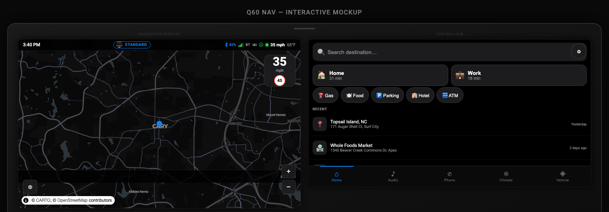
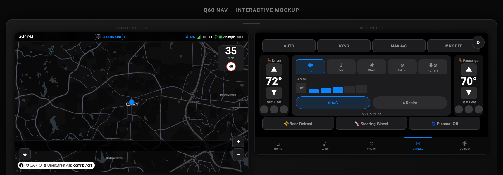
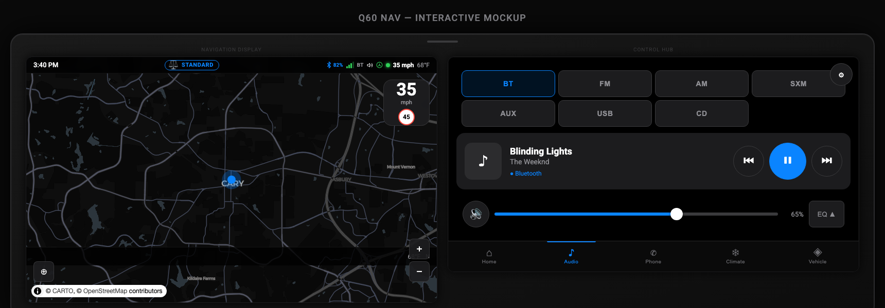
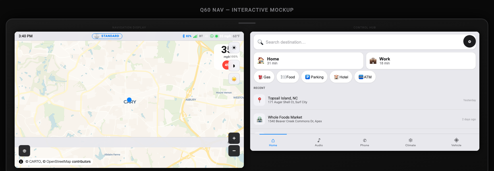
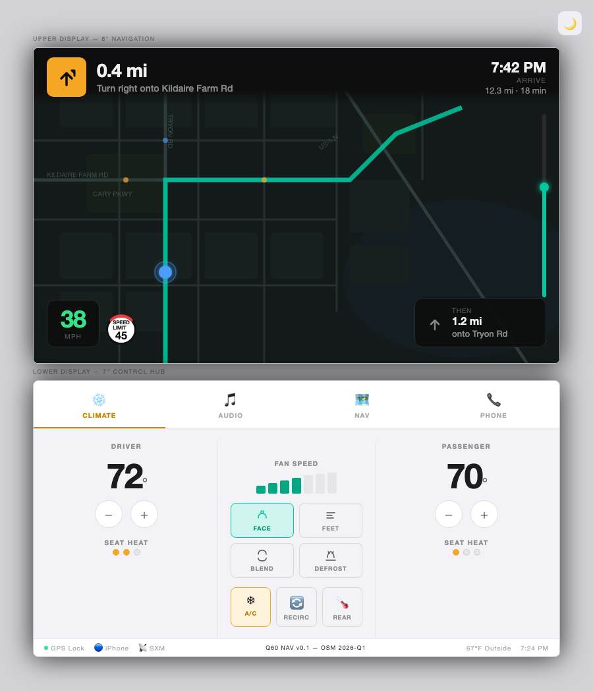
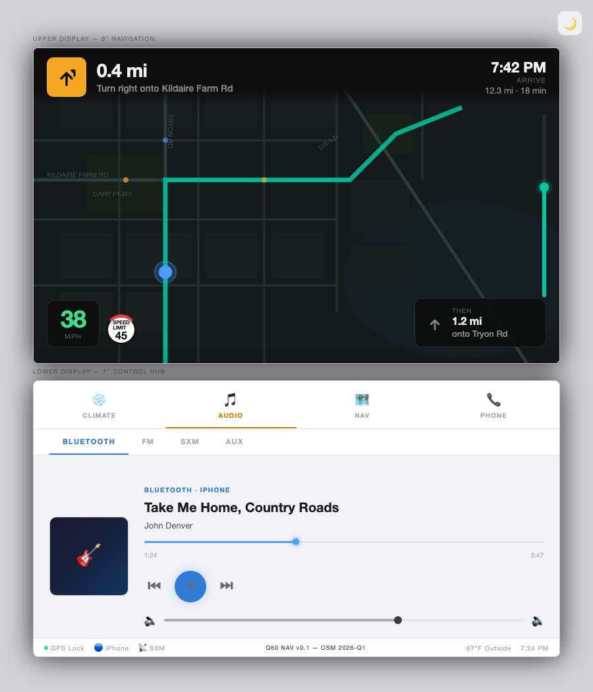

# Q60 Nav Rebuild

Ground-up replacement navigation system for the **2017 Infiniti Q60** (Clarion QY5092 DCU).
Replaces the factory head unit software with a dual-screen Qt 6 / Linux 4.19 application
while preserving the original firmware as a permanent, non-destructive fallback.

> **Scope:** This repository contains original software authored for this project,
> build tooling, hardware research notes, and documentation. No proprietary firmware,
> OEM software, or copyrighted third-party binaries are included or distributed.

---

## Table of Contents

- [UI Mockups](#ui-mockups)
- [Background](#background)
- [Hardware Platform](#hardware-platform)
- [System Architecture](#system-architecture)
- [Key Findings](#key-findings)
- [Build System](#build-system)
- [Boot Safety Model](#boot-safety-model)
- [Service Layer](#service-layer)
- [UI Layer](#ui-layer)
- [Map & Routing Pipeline](#map--routing-pipeline)
- [CAN Bus — Status & Warning](#can-bus--status--warning)
- [Open Source Dependencies](#open-source-dependencies)
- [Legal](#legal)
- [Community](#community)
- [License](#license)

---

> **UI Status (as of latest commit):** Apple CarPlay-inspired redesign complete across both screens.
> Interactive prototype: [`docs/mockup/index.html`](docs/mockup/index.html)

---

## Background

The factory navigation system in the 2017 Infiniti Q60 is a **Clarion QY5092 DCU**
(Display Control Unit). While functional, it runs outdated map data and an aging
software stack with no update path. This project rebuilds the software layer from
scratch on the same hardware, adding:

- Offline vector maps (OpenMapTiles) via MapLibre GL Native
- Offline routing via Valhalla 3.4
- Full climate, audio, and Bose DSP integration via SocketCAN
- Dual-screen Qt 6 QML UI targeting both LVDS outputs simultaneously
- BlueZ 5 AVRCP Bluetooth audio and call handling

The original firmware is preserved on eMMC slot A and is **never overwritten**.
The new system boots from slot B. A hardware-level safety mechanism automatically
restores the original if the new system fails to start.

---

## UI Mockups

Interactive dual-screen HTML prototype at [`docs/mockup/index.html`](docs/mockup/index.html).
Both screens render at native resolution — **800×480 upper (8" nav)** / **800×420 lower (7" control hub)** —
with live OSM tile map, full tab switching, day/night mode, and simulation controls.

**To run:**
```bash
cd docs/mockup && python3 -m http.server 8080
# open http://localhost:8080/index.html
```

### Night Mode

| Home + Nav | Climate | Audio |
|:---:|:---:|:---:|
|  |  |  |

### Day Mode

| Home + Nav | Climate | Audio |
|:---:|:---:|:---:|
|  |  |  |

**Controls:**
- **Lower nav bar:** Home · Audio · Phone · Climate · Vehicle — all tabs functional
- **Joystick panel** (upper-right of lower screen) — day/night toggle, brightness, route start/stop, notification injection
- **Reverse sim:** camera view on upper screen + parking guidelines
- **Cruise sim (Vehicle tab):** cruise bubble on upper screen left side

---

### Upper Screen — Navigation Display (800×480)

Persistent elements (always visible):

| Element | Location | Notes |
|---|---|---|
| Status bar | Top, 32px | Clock · GPS lock · Bluetooth · signal icons |
| Speed badge | Top-right | Current speed + posted limit; turns amber if over limit |
| Drive mode bar | Bottom, 36px | Drive mode badge (Standard/Sport/Sport+/Eco/Snow/Personal) · outside temp · compass heading |

Nav idle state (no active route):
- Dark map canvas with subtle grid placeholder
- Faint "Q60" watermark top-left

Nav active state (route in progress):

| Element | Location | Notes |
|---|---|---|
| Turn card | Top-left | Turn arrow · distance-to-maneuver · next street name |
| Orange pulse bar | Below turn card | Animates when turn is <0.2 mi away |
| **Cruise bubble** | **Left side, below turn card** | **80×68px — speed + CRUISE label; blue pulse ring when active; `visible: VehicleService.cruiseActive`** |
| Bottom strip (72px) | Bottom | ETA · remaining distance · current street; 3-column layout |
| Rerouting banner | Top | Amber overlay when `NavigationService.rerouting` is true |
| GPS acquiring indicator | Above bottom strip | Pulsing orange dot when no GPS lock |

**Reverse camera (RearCameraView):**
- Loaded/unloaded dynamically via `Loader` in `Main.qml` (`z: 80`) — camera device fully released when not in reverse
- Activates on `StatusBridge.reverseActive`; 180ms fade transition
- Full 800×480 canvas with three-zone trapezoid parking guidelines (green/amber/red), distance markers (6 ft / 3 ft / 1 ft), and R badge
- Camera feed isolated in `components/CameraFeed.qml` (sole `import QtMultimedia 6.6`) so Loader fails gracefully if module absent on i386 build
- Z-ordering: WelcomeOverlay (z:50) → RearCameraView (z:80) → IncomingCallOverlay (z:100)

Notification banner (overlaid above drive mode bar):
- Centered pill, slides down from status bar edge
- 4-second auto-dismiss with manual ✕ dismiss
- Severity levels: info (blue) · warn (amber) · alert (red) · success (green)
- Queue-based — multiple notifications cycle in sequence
- Triggered by: low fuel · door open · parking brake · overspeed

Day / Night mode + brightness:
- Night mode (default): dark map, charcoal panels, `rgba(0,0,0,0.88)` strips
- Day mode: light grey backgrounds, dark text, full map contrast
- Toggle via joystick center-push or `⊙` button in sim panel
- Brightness: 20–100% range; semi-transparent overlay dims both screens
- Joystick up/down adjusts brightness ±10%; a floating brightness HUD confirms changes

---

### Lower Screen — Control Hub (800×420)

**8-item bottom navigation bar (60px):** 7 content tabs × 100px + 1 Volume quick-action × 100px = 800px.
Active tab: blue (#0A84FF) indicator bar at top + colored icon/label. Phone tab shows pulsing green dot when call is active.

Auto-switching: reverse gear → tab 7 (lower screen shows camera placeholder); incoming call → Phone tab. Both restore to previous tab on exit.

---

**Home tab (⌂)** — turn-by-turn nav companion

| Element | Notes |
|---|---|
| Turn arrow | Large canvas element — same direction logic as upper screen |
| Distance countdown | Primary glance target; ft/mi auto-switching |
| ETA · remaining · speed | 3-column stat cards |
| Along-route pills | Gas · food · lodging quick-search |
| Turn list | Scrollable upcoming maneuvers |
| Stop navigation button | Full-width, bottom |

---

**Audio tab (♪)**

| Element | Notes |
|---|---|
| Source selector | BT / FM / AM / SXM / AUX |
| Album art | 120×120 placeholder (real art via AVRCP) |
| Track / artist / album | BlueZ MediaPlayer1 D-Bus |
| Progress bar | Visual only until AVRCP Seek is validated |
| Transport controls | Flanking seek buttons (⏮ / ⏯ / ⏭) OEM-style layout |
| Preset bar | Pinned 6-station preset row at bottom |
| EQ | Bass/Mid/Treble ±5 dB; Bose DSP toggle |

---

**Phone tab (✆)**

| Element | Notes |
|---|---|
| Dial pad | Full 10-key with call button |
| Contacts / Recent / Messages | Three sub-tab panels, scrollable |
| **Persistent right panel (88px)** | **Answer (green ✆) · End (red ✆) · Mute — always visible regardless of call state** |
| Incoming call overlay | Shown on both screens simultaneously via `StatusBridge.callActive` |

The 88px right panel is permanently docked; the main content area anchors `right: callPanel.left` so nothing is obscured.

---

**Climate tab (❄)**

| Element | Notes |
|---|---|
| Driver / passenger temp zones | ±1°F buttons; large temp readout |
| **Fan speed row (full-width)** | **OFF + speeds 1–5 spread across full screen width; active speed solid blue, below-active speeds tinted** |
| Airflow mode | Face / feet / blend / defrost icons |
| Toggles | A/C · Recirc · Sync zones |
| Seat heat / steering wheel heat | 0–3 levels per zone |
| Outside temp | CAN-sourced; shown center-bottom |

Fan speed row sits between the zone card and the extras row — maximizes use of available screen real estate.

---

**Vehicle tab (◈)**

| Element | Notes |
|---|---|
| Drive mode selector | Standard · Sport · Sport+ · Eco · Snow · Personal |
| **TPMS card (364×160)** | **Q60 coupe Canvas silhouette (top-down) + 4 corner PSI readouts** |
| PSI color coding | ≥30 psi → green (#30D158) · 25–29 → amber (#FF9F0A) · <25 → red (#FF453A) · 0 → grey |
| **Door / fuel card** | **2-door default (FL/FR + trunk); fuel bar with fill level + percentage** |
| Door state | Open = red · Closed = green |
| `fourDoorModel` bool | Default `false` (Q60 coupe); set `true` via VIN detection — RL/RR doors animate in with `Behavior on height` |
| Active settings | Steering weight · suspension · throttle response |

The Q60 coupe body is drawn with `bezierCurveTo` on a Canvas (no `roundRect` — not available in Mesa softpipe).
The fuel slider has been removed; a clean horizontal bar + percentage replaces the arc gauge.

---

**Info tab (ℹ)**

System information: firmware version, CAN bus status, GPS fix details, uptime.

---

**Settings tab (⚙)**

- **Display:** brightness slider, day/night toggle, auto-dim
- **Navigation:** reroute threshold, units (mi/km), voice guidance
- **Audio:** source defaults, BT device list, EQ preset
- **System:** about · software version · CAN bus status

---

**Volume quick-action (🔊)**

- 8th nav bar item — not a content tab
- Taps toggle a 64px slide-up tray above the nav bar: mute toggle · drag slider · percentage readout
- Auto-dismisses after 4 seconds of no interaction
- Amber (#FF9F0A) accent when overlay is open; grey when closed
- Closing any content tab while volume overlay is open collapses the tray

---

### Simulation Controls (mockup only)

The prototype includes a floating sim panel for testing without hardware:

- **Joystick:** 3×3 directional grid — up/down control brightness; push toggles day/night
- **Nav sim:** Start route / Stop route / Trigger reroute buttons
- **Notifications:** Inject low fuel / door open / brake / speed alerts
- **Drive mode:** Direct mode buttons (Standard → Sport+, etc.)
- **Brightness / Day-Night HUD:** Appears on joystick action, auto-hides after 3s

---

## Hardware Platform

### SoC: Intel Atom E6xx "Crossville Lapis"

| Property | Value |
|---|---|
| Architecture | i686 (32-bit x86, Bonnell microarchitecture) |
| ISA extensions | MMX, SSE, SSE2, SSE3, SSSE3 — **no SSE4, no AVX** |
| RAM | 2 GB DDR2 (confirmed via runtime probe 2026-05-16) |
| eMMC | `/dev/mmcblk0` — 9 partitions |
| Boot firmware | UEFI (elilo.efi, 2013 vintage) |
| CAN controllers | 2× Bosch M_CAN (socketcan: can0/can1/can2) |
| Serial GPS | UART (ttyS*) |
| Display | 2× LVDS (800×480 upper, 800×420 lower) |
| Audio | HDA Intel (Bose amp, DSP via CAN) |
| GPU | PowerVR SGX — **no open driver; software render only** |

### eMMC Partition Map

| Partition | Role | Notes |
|---|---|---|
| mmcblk0p1 | FAT32 boot (127 MB) | elilo.conf, kernel images |
| mmcblk0p2 | **Slot A root** (ext4) | Original firmware — **never written** |
| mmcblk0p3 | Slot B root (ext4) | New system (this project) |
| mmcblk0p4 | Slot A misc | |
| mmcblk0p5 | Slot A android root | Original Android environment |
| mmcblk0p6 | Slot B android | Unused in new system |
| mmcblk0p7 | pmemdisk (50 MB) | In-memory ramdisk — **not user data** |
| mmcblk0p8 | Nav app (3 GB, ext4) | Valhalla tiles, MapLibre tiles |
| mmcblk0p9 | User data (1 GB, ext4) | App data, MBGL cache |

### Bootloader: elilo.efi

- Minimal EFI boot loader (2013, 153 KB PE32)
- **No automatic fallback.** `default=` is absolute; a failed boot loops forever.
- This is the primary safety concern — mitigated by the FAT32 boot counter (see below).
- Original kernel command line preserved in `docs/boot-safety.md`.

### Kernel

| | Original | New |
|---|---|---|
| Version | 2.6.37.6 (Android/Intel fork) | 4.19.0 |
| Build | android-intel-crossville\_lapis-fastboot | q60\_atom\_defconfig |
| Watchdog | Not configured | CONFIG\_iTCO\_WDT=y (30s) |
| CAN | Module present | CONFIG\_CAN=y, CAN\_RAW, CAN\_BCM |
| DRM | Custom PowerVR | DRM\_I915 removed; fbdev + Weston swrast |
| EFI | — | CONFIG\_EFI\_VARS=y, CONFIG\_EFIVAR\_FS=y |

---

## System Architecture

```
┌──────────────────────────────────────────────────────────────┐
│                       Hardware Layer                          │
│  CAN bus  │  GPS UART  │  LVDS×2  │  HDA audio  │  BT  │ LTE │
└─────┬─────┴─────┬──────┴────┬─────┴──────┬──────┴──┬───┴──┬──┘
      │           │           │            │         │      │
┌─────▼───────────▼───────────▼────────────▼─────────▼──────▼──┐
│                    Linux 4.19 + SysV init                      │
│  SocketCAN  gpsd(:2947)  Weston(DRM)  ALSA  BlueZ5  NetworkMgr│
└─────┬──────────┬───────────┬───────────┬────────┬───────┬─────┘
      │          │           │           │        │       │
┌─────▼──────────▼───────────▼───────────▼────────▼───────▼─────┐
│                     C++ Service Layer                           │
│  VehicleService  NavigationService  AudioService               │
│  SearchService   StatusBridge                                  │
│  NetworkService  WeatherService  FuelService                   │
└─────────────────────────┬──────────────────────────────────────┘
                          │ QML context properties
┌─────────────────────────▼──────────────────────────────────────┐
│                     Qt 6 QML UI Layer                           │
│                                                                 │
│  Upper screen (800×480)        Lower screen (800×420)          │
│  ├─ NavigationView             ├─ ControlHubView               │
│  │   ├─ MapLibreItem           │   ├─ NavCompanionView (Home)  │
│  │   ├─ TurnCard + CruiseBubble│   ├─ AudioView               │
│  │   └─ BottomInfoStrip        │   ├─ PhoneView                │
│  ├─ RearCameraView (z:80)      │   ├─ ClimateView              │
│  │   └─ CameraFeed (QtMM)      │   ├─ VehicleStatusView        │
│  ├─ WelcomeOverlay (z:50)      │   ├─ InfoView                 │
│  └─ IncomingCallOverlay (z:100)│   ├─ SettingsView             │
│                                │   └─ VolumeOverlay (tray)     │
│                                └─ IncomingCallOverlay (z:100)  │
└────────────────────────────────────────────────────────────────┘
```

---

## Key Findings

Research and reverse-engineering results documented here for the benefit of
others working with similar Clarion / Infiniti / Nissan DCU hardware.

### elilo Has No Boot Fallback

Verified by binary string inspection of the elilo.efi PE32 image. There is no boot
counting, no BootNext EFI variable, and no timeout-triggered entry switching. The
`default=` label in `elilo.conf` is the only decision point.

**Implication:** Any attempt to boot a broken kernel loops indefinitely. A software
fallback mechanism on the FAT32 boot partition is mandatory (see Boot Safety Model).

### PowerVR SGX — No Viable Driver

The Atom E6xx integrates a PowerVR SGX GPU. No open-source driver exists for this
GPU on Linux 4.19. All rendering uses Mesa software rasterization (`swrast`) via
the `QT_QUICK_BACKEND=software` environment variable.

**Implication:** Frame budget is CPU-limited. Qt Quick animations are functional
but should avoid particle systems or heavy shader effects.

### CAN Topology (Reverse-Engineered / Partially Known)

Three CAN buses are accessible:

| Bus | Rate | Role |
|---|---|---|
| can0 | 500 kbps | Vehicle CAN (climate, speed, gear, outside temp) |
| can1 | 500 kbps | Bose AV CAN (amplifier wake, source switching) |
| can2 | 250 kbps | Steering wheel buttons |

> ⚠️ **CAN IDs in `VehicleService.h` are community-sourced estimates for similar
> Nissan/Infiniti platforms. They have not been validated by J2534 capture on this
> specific vehicle. Do not send write frames to a live vehicle until all IDs are
> verified.**

### DENSO Proxy Daemons

The original system runs several DENSO-authored IPC daemons:

| Binary | Role | IPC |
|---|---|---|
| `sxmcgs.out` | SiriusXM tuner proxy | Named pipe `/tmp/sxmcgs.cmd` |
| `radiofc.out` | FM/AM tuner | Named pipe `/tmp/radiofc.cmd` |
| `sound.out` | Audio routing | Named pipe `/tmp/sound.cmd` |
| `vcan.out` | Virtual CAN bridge | Named pipe `/tmp/vcan.cmd` |

These daemons are part of the original firmware and are not redistributed here.
The new `AudioService` writes command strings to their named pipes to control
audio source switching.

### Weston on Software Render

Weston compositor (DRM backend) starts successfully with Mesa swrast. The two
LVDS outputs enumerate as `LVDS-1` and `LVDS-2` in the DRM subsystem (pending
hardware verification — connector names may differ). Fallback to fbdev is
implemented in `S30-weston`.

### GPS Module

GPS is on a UART. The specific ttyS* device requires probing on hardware
(expected: ttyS0 or ttyS1 at 9600 or 4800 baud). GPSD is configured for ttyS0
as a starting point.

### pmemdisk Partition (mmcblk0p7)

The original kernel boots with `pmemdisk=/dev/mmcblk0p7` — a 50 MB in-memory
block device used as a RAM overlay. It is **not user data** and is not mounted
in the new system's fstab. Earlier documentation that mapped this to `/data` was
a bug (corrected; `/data` uses mmcblk0p9).

---

## Build System

### Prerequisites

- Docker Desktop (Apple Silicon or amd64)
- macOS or Linux host
- ~20 GB free disk space
- CO OSM PBF at `/tmp/colorado-latest.osm.pbf`

### Docker Toolchain Image

```bash
docker build -t q60-toolchain -f Dockerfile.toolchain .
```

Ubuntu 22.04 base, GCC 11.4 with `-m32 -march=bonnell` multilib support.

### Build Order

```bash
# 1. Qt 6.6.3 host tools (amd64, ~15 min)
docker run --rm -v $(pwd):/build q60-toolchain \
    bash /build/deps/build-qt6-host.sh

# 2. Qt 6.6.3 i386 from source (~90-120 min)
docker run --rm -v $(pwd):/build q60-toolchain \
    bash /build/deps/build-qt6-i386.sh

# 3. MapLibre GL Native i386 (pre-built static lib included in output/)
#    If rebuilding: bash deps/build-maplibre-i386.sh

# 4. Valhalla 3.4 i386 routing engine (~20 min)
docker run --rm -v $(pwd):/build q60-toolchain \
    bash /build/deps/build-valhalla-i386.sh

# 5. Application binary
./scripts/build-app.sh

# 6. Valhalla routing tiles (~30-45 min, CO)
./scripts/build-tiles.sh

# 7. MapLibre vector tiles (~30-60 min, CO z0-z14)
./scripts/build-map-tiles.sh

# 8. Rootfs image
./scripts/package-rootfs.sh

# 9. Deploy (eMMC out of car, USB adapter)
./scripts/deploy-to-image.sh --test   # flips default=q60nav
```

---

## Boot Safety Model

Full analysis: [`docs/boot-safety.md`](docs/boot-safety.md)

### The Problem

elilo has no fallback. A failed new kernel → infinite boot loop.

### The Solution: FAT32 Boot Counter

`/opt/nav/start.sh` (the first thing the new kernel runs) does:

1. Read `/boot/q60_boot_attempts` (FAT32, always accessible externally)
2. If count ≥ 2: rewrite `elilo.conf` → `default=logan1`, delete counter, reboot
3. Increment and write counter to FAT32
4. Continue boot, start services
5. On successful app launch: **delete counter**

Two consecutive failures auto-restore the original firmware. The counter file is
visible from any Mac via USB-eMMC adapter without booting the device.

### Slot A Guarantee

`mmcblk0p2` (Slot A root) and `mmcblk0p5` (Slot A Android) are **never written**
by any script in this repository. This is enforced by convention and verified
manually. Slot A is the permanent safety net.

### Recovery

If all else fails:
```bash
./scripts/restore-logan1.sh /Volumes/boot\ 1
# Rewrites elilo.conf default=logan1 and removes boot counter
# Takes ~10 seconds. Works while device is powered off.
```

---

## Service Layer

All services are Qt 6 QObjects with signals exposed to QML via `rootContext()`.

### VehicleService

- SocketCAN raw sockets on can0, can1, can2
- Parses: vehicle speed, gear (reverse detection), outside temp, HVAC state, headlights
- Writes: full HVAC frame (temp, fan, AC, recirc, mode, seat heat), Bose amp wake
- Steering wheel button events from can2

> ⚠️ CAN frame IDs are **estimates** — verify before sending write frames.

### NavigationService

- GPSD TCP client (localhost:2947, JSON TPV)
- Valhalla HTTP client (localhost:8002/route) — POST JSON, parse legs/maneuvers
- Step-based instruction advancement, automatic reroute timer (30s)
- Emits: position, heading, instruction, distance, ETA, speed

### AudioService

- BlueZ 5 D-Bus client: `GetManagedObjects` → MediaPlayer1 → AVRCP play/pause/skip
- DENSO proxy IPC: writes command strings to named pipes
- ALSA volume via `amixer sset Master`
- Bose amp wake delegation to VehicleService

### SearchService

- Valhalla geocode and reverse geocode via HTTP (localhost:8002)

### StatusBridge

- Wires all service signals: clock (30s timer), call routing, steering wheel → volume
- Single QML-accessible object coordinating both screens

### NetworkService

- Detects connectivity mode: Wi-Fi (development/home) vs. LTE TCU (in-vehicle)
- `tcu-detect.sh` runs at first boot to identify which interface is active and writes a persistent mode flag
- Dual-mode: same app binary runs in both environments; services switch data sources transparently

### WeatherService

- Fetches current conditions and short forecast via HTTP
- Updates outside temp display on upper screen when GPS-derived location is available
- Falls back to CAN-sourced outside temp (VehicleService) when network is unavailable

### FuelService

- Tracks fuel level from CAN (can0) and exposes to both screens
- Triggers low-fuel notification banner on upper screen when level drops below threshold

---

## UI Layer

Qt 6 QML, software-rendered (Mesa swrast), targeting two windows on two LVDS outputs.

### Upper Screen — NavigationView (800×480)

- `MapLibreItem` QQuickItem backed by `mbgl::HeadlessFrontend` (headless GL → QImage → QSGImageNode)
- Turn card: `TurnArrow` canvas + distance + street name
- **Cruise bubble** (`cruiseWidget`): 80×68px rounded rect, left side below turn card — speed + CRUISE label, blue pulse ring animation; `visible: VehicleService.cruiseActive`
- Speed badge: top-right (`SpeedWidget`) — current speed + posted limit; turns amber if over limit
- Bottom strip (72px): ETA · remaining distance · current street; `visible: StatusBridge.navActive`
- Overlays: approaching-turn amber pulse bar, GPS acquiring indicator, rerouting banner

**RearCameraView (z:80) — loaded dynamically from Main.qml:**
- `Loader { active: StatusBridge.reverseActive; source: active ? "screens/RearCameraView.qml" : "" }`
- Full 800×480 canvas: R badge top-left, 3-zone trapezoid parking guides (green/amber/red), right-edge distance markers
- `CameraFeed.qml` (separate file) contains the sole `import QtMultimedia 6.6` — Loader failure is graceful
- 180ms opacity fade in/out

### Lower Screen — ControlHubView (800×420)

8-item bottom nav bar (60px, `Item`-based, no `TabBar`):
- **Home** (⌂) → `NavCompanionView` — turn-by-turn: ft/mi countdown, ETA, speed vs limit
- **Audio** (♪) → `AudioView` — BT/FM/AM/SXM/AUX, OEM transport layout, pinned preset bar
- **Phone** (✆) → `PhoneView` — DTMF pad, contacts/recent, **persistent 88px right panel** (Answer/End/Mute always visible)
- **Climate** (❄) → `ClimateView` — dual temp zones, **full-width fan speed row** (OFF + 1–5), mode/AC/recirc, seat heat
- **Vehicle** (◈) → `VehicleStatusView` — drive mode, **Q60 coupe Canvas TPMS** with color-coded PSI, door/fuel card, `fourDoorModel` bool
- **Info** (ℹ) → `InfoView` — firmware version, CAN status, GPS details, uptime
- **Settings** (⚙) → `SettingsView` — display, nav, audio, system settings
- **Volume** (🔊) — quick-action; slides up 64px `volumeOverlay` tray, amber accent, 4s auto-dismiss

Auto-switching: `StatusBridge.reverseActive` → tab 7 (camera placeholder on lower); `StatusBridge.onSwitchLowerToPhone` → Phone tab. Both restore `previousTab` on exit.

### Map Style

Dark green automotive theme: `rootfs/opt/nav/style/q60-dark.json`

MapLibre GL style using OpenMapTiles vector tiles. Key layers:
motorways in green (#3a7a20), primary roads, place labels, POI at z≥15.
Route overlay (`q60-route` source) rendered in cyan (#00d4ff) at 6px width.

---

## Map & Routing Pipeline

### Valhalla Routing Tiles

```bash
./scripts/build-tiles.sh
# Uses official Valhalla Docker image (ghcr.io/valhalla/valhalla:run-latest)
# Input:  /tmp/colorado-latest.osm.pbf
# Output: output/valhalla-tiles/ → /opt/valhalla/tiles/ on device
```

Config: `output/valhalla-config.json`. Max cache: 64 MB (RAM-constrained device).

### MapLibre Vector Tiles (co.mbtiles)

```bash
./scripts/build-map-tiles.sh
# Uses tilemaker Docker image (ghcr.io/systemed/tilemaker)
# Input:  /tmp/colorado-latest.osm.pbf
# Output: output/vector-tiles/co.mbtiles → /opt/nav/tiles/co.mbtiles on device
# Zoom:   z0-z14, ~400-700 MB for CO
```

### Valhalla HTTP Proxy

`valhalla_service` is built in CLI mode (no prime_server). A minimal C HTTP daemon
(`rootfs/opt/valhalla/valhalla-httpd.c`) wraps it:

- Listens TCP :8002
- Maps HTTP POST paths → Valhalla action strings
- Forks `valhalla_service config.json action body`, captures stdout
- Returns JSON response

Build: `gcc -m32 -march=bonnell -O2 -o valhalla-httpd valhalla-httpd.c`

---

## CAN Bus — Status & Warning

> **⚠️ IMPORTANT:** All CAN frame IDs currently in `VehicleService.h` are
> **community-sourced estimates** based on Infiniti/Nissan platform research.
> They have **not been validated** on the [REDACTED] platform (Q60 Red Sport).
>
> **Do not send any CAN write frames to a running vehicle until every frame ID
> has been verified via J2534 OBD-II capture.** Sending incorrect write frames
> to automotive CAN buses can cause unexpected behavior in safety systems.
>
> The read-only parsing (speed, gear, temp, etc.) is lower risk but should
> still be validated before relying on it for routing or display decisions.

### J2534 Capture Process

1. Connect a J2534-compatible pass-through device (e.g., Drew Technologies MongoosePro)
2. Capture with raw CAN logging while operating each vehicle function
3. Cross-reference with `VehicleService.h` — update `CAN_*` constants and frame formats
4. Validate write frames in a bench environment before in-vehicle use

---

## Open Source Dependencies

This project builds upon the following open-source projects. Their licenses govern
their respective source code; see each project's repository for details.

| Dependency | License | Used For |
|---|---|---|
| [Qt 6.6.3](https://www.qt.io/) | LGPL 3.0 | Application framework, QML |
| [MapLibre GL Native](https://github.com/maplibre/maplibre-gl-native) | BSD 2-Clause | Vector map rendering |
| [Valhalla 3.4](https://github.com/valhalla/valhalla) | MIT | Offline routing engine |
| [Linux 4.19](https://kernel.org) | GPL 2.0 | Operating system kernel |
| [Weston](https://gitlab.freedesktop.org/wayland/weston) | MIT | Wayland compositor |
| [gpsd](https://gpsd.gitlab.io/gpsd/) | BSD 2-Clause | GPS daemon |
| [OpenStreetMap](https://www.openstreetmap.org/) | ODbL 1.0 | Map data |
| [elilo](https://sourceforge.net/projects/elilo/) | GPL 2.0 | EFI bootloader |
| [tilemaker](https://github.com/systemed/tilemaker) | FLIC License | Vector tile generation |

Qt is used under LGPL 3.0 (dynamic linking). The q60nav application does not
statically incorporate Qt source.

---

## Legal

### Reverse Engineering for Interoperability

The hardware research in this project — including partition map analysis, bootloader
behavior, CAN bus investigation, and DENSO daemon IPC interface documentation —
constitutes reverse engineering for the purpose of interoperability with hardware
the author owns.

This activity is lawful in the United States under:

- **17 U.S.C. § 1201(f)** — DMCA exemption for reverse engineering for interoperability
- **17 U.S.C. § 117** — Owner's rights to adapt software for use on owned hardware
- **Right to Repair** principles — the vehicle and its components are the property
  of the author

No proprietary firmware, OEM software, copyrighted binary blobs, or trade secrets
are reproduced in this repository. The original Clarion/DENSO/Nissan firmware
remains on the device's Slot A and is not distributed.

### No OEM Affiliation

This project is not affiliated with, endorsed by, or sponsored by Nissan Motor Co.,
Infiniti, Clarion, DENSO, or any other manufacturer of the hardware described herein.
Product names and trademarks are the property of their respective owners and are
referenced here solely for identification purposes.

### No Warranty / Safety Disclaimer

This software is provided for personal, experimental use on owned hardware.

**The author makes no warranty, express or implied, that this software is safe,
reliable, or fit for use in a moving vehicle.** Automotive software affects safety
systems. Use at your own risk. Do not use this software to control any vehicle
system in a manner that could endanger passengers, other road users, or property.

CAN bus write operations in particular carry inherent risk. The author expressly
disclaims any liability for damage to vehicle systems, personal injury, or property
damage arising from use of this software or the information in this repository.

---

## Community

This project benefited from reverse-engineering knowledge shared by the community at
**[Clarion/Infiniti DCU Research Discord](https://discord.com/channels/1342723144485441536/1342723400975650877)** —
specifically the channel that provided the final critical information needed to unlock
the eMMC partition layout and boot mechanism on the Clarion QY5092. That community's
collective research saved weeks of blind probing. If you're working on similar hardware,
that's the place to be.

---

## License

Original source code in this repository (excluding third-party dependencies) is
released under the **MIT License**.

```
MIT License

Copyright (c) 2026 q60-nav-rebuild contributors

Permission is hereby granted, free of charge, to any person obtaining a copy
of this software and associated documentation files (the "Software"), to deal
in the Software without restriction, including without limitation the rights
to use, copy, modify, merge, publish, distribute, sublicense, and/or sell
copies of the Software, and to permit persons to whom the Software is
furnished to do so, subject to the following conditions:

The above copyright notice and this permission notice shall be included in all
copies or substantial portions of the Software.

THE SOFTWARE IS PROVIDED "AS IS", WITHOUT WARRANTY OF ANY KIND, EXPRESS OR
IMPLIED, INCLUDING BUT NOT LIMITED TO THE WARRANTIES OF MERCHANTABILITY,
FITNESS FOR A PARTICULAR PURPOSE AND NONINFRINGEMENT. IN NO EVENT SHALL THE
AUTHORS OR COPYRIGHT HOLDERS BE LIABLE FOR ANY CLAIM, DAMAGES OR OTHER
LIABILITY, WHETHER IN AN ACTION OF CONTRACT, TORT OR OTHERWISE, ARISING FROM,
OUT OF OR IN CONNECTION WITH THE SOFTWARE OR THE USE OR OTHER DEALINGS IN THE
SOFTWARE.
```

---

*Platform: 2017 Infiniti Q60 Red Sport 400 AWD · Clarion QY5092 DCU · Intel Atom E6xx · Linux 4.19 · Qt 6.6.3 · Valhalla 3.4 · MapLibre GL Native*
