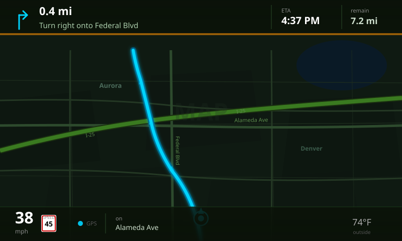
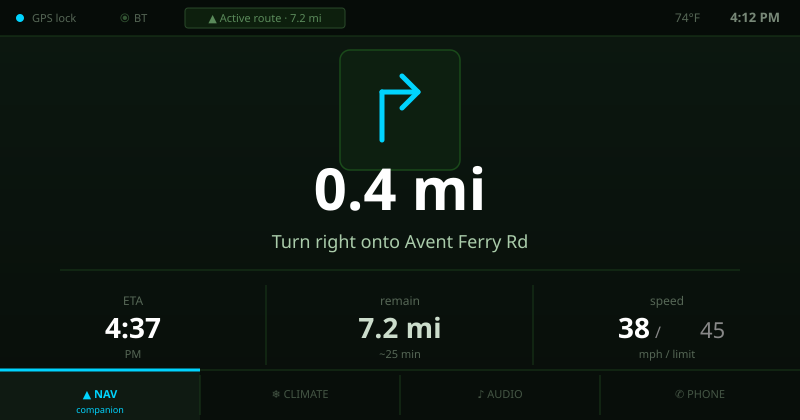
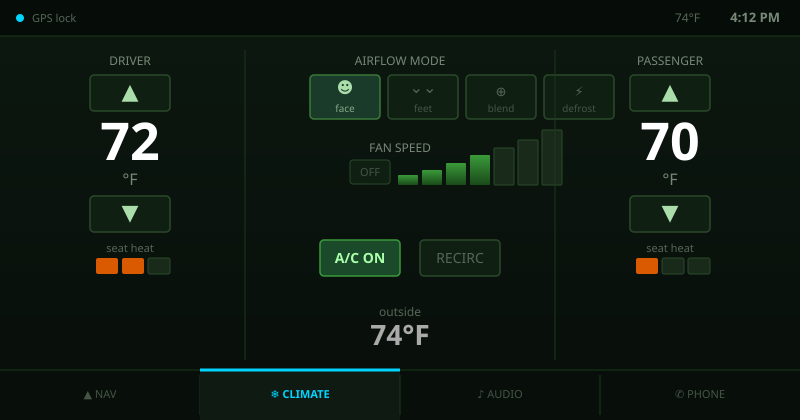
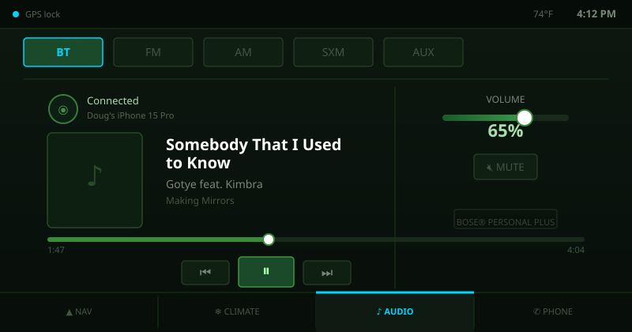
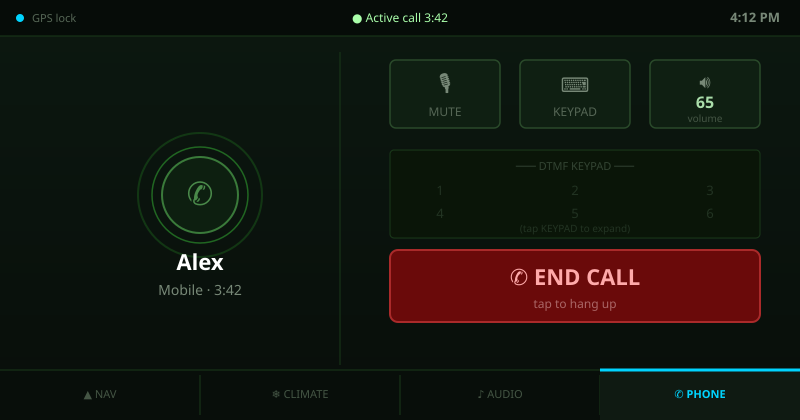

# Q60 Nav Rebuild

Ground-up replacement navigation system for the **2017 Infiniti Q60** (Clarion QY5092 DCU).
Replaces the factory head unit software with a dual-screen Qt 6 / Linux 4.19 application
while preserving the original firmware as a permanent, non-destructive fallback.

> **Scope:** This repository contains original software authored for this project,
> build tooling, hardware research notes, and documentation. No proprietary firmware,
> OEM software, or copyrighted third-party binaries are included or distributed.

---

## Table of Contents

- [UI Mockups](#ui-mockups)
- [Background](#background)
- [Hardware Platform](#hardware-platform)
- [System Architecture](#system-architecture)
- [Key Findings](#key-findings)
- [Build System](#build-system)
- [Boot Safety Model](#boot-safety-model)
- [Service Layer](#service-layer)
- [UI Layer](#ui-layer)
- [Map & Routing Pipeline](#map--routing-pipeline)
- [CAN Bus — Status & Warning](#can-bus--status--warning)
- [Open Source Dependencies](#open-source-dependencies)
- [Legal](#legal)
- [Community](#community)
- [License](#license)

---

## Background

The factory navigation system in the 2017 Infiniti Q60 is a **Clarion QY5092 DCU**
(Display Control Unit). While functional, it runs outdated map data and an aging
software stack with no update path. This project rebuilds the software layer from
scratch on the same hardware, adding:

- Offline vector maps (OpenMapTiles) via MapLibre GL Native
- Offline routing via Valhalla 3.4
- Full climate, audio, and Bose DSP integration via SocketCAN
- Dual-screen Qt 6 QML UI targeting both LVDS outputs simultaneously
- BlueZ 5 AVRCP Bluetooth audio and call handling

The original firmware is preserved on eMMC slot A and is **never overwritten**.
The new system boots from slot B. A hardware-level safety mechanism automatically
restores the original if the new system fails to start.

---

## UI Mockups

> ⚠️ **These are static SVG wireframes — very raw, first-pass only.** The app isn't running on hardware yet.
> Colors and layout match the actual QML code, but proportions, typography, and interaction polish are
> all still TBD. Consider this a visual translation of the data model, not a finished design.

---

### Screen 1 — Navigation View (upper display, 800×480)



**What's here:**
- Simulated vector map using the dark-green `q60-dark.json` color scheme (OpenMapTiles palette)
- Active route rendered as a cyan line (`#00d4ff`) with soft glow — matches MapLibre `q60-route` layer
- Current position puck with heading arrow
- **Top HUD:** turn arrow, distance-to-maneuver, next street name, ETA, remaining distance
- **Bottom HUD:** current speed, posted speed limit sign, road name, GPS lock dot, outside temp
- Orange pulse bar at the top HUD edge activates when a turn is <0.2 mi away

**UI/UX notes and known issues:**
- The top HUD is dense. On the actual 8" display at arm's reach, the 22px distance readout
  is borderline — may need to go 28-32px with street name truncated to one line.
- Speed limit sign is a visual placeholder; actual sign shape needs a red-border rectangle
  matching US MUTCD standards — size is about right at 30×34px.
- ETA and remaining distance compete for the same cognitive space. One option: hide "remain"
  when the route is under 5 mi and just show a large ETA countdown.
- The approaching-turn pulse bar (orange, 4px) is subtle. On a high-ambient-light display
  this needs to be thicker (6-8px) or use a pulsing animation.
- Route glow filter (`feGaussianBlur σ=4`) will be cheap to render in software — confirmed
  viable on Atom E6xx at 800×480 in the current software-render pipeline.

---

### Screen 2 — Nav Companion View (lower display, 800×420)



**What's here:**
- Lower screen, running alongside the map on the upper display
- Large turn arrow (120×120 canvas element) — same `TurnArrow.qml` component, bigger draw area
- Distance countdown in large type (58px) — the primary glance target while driving
- Bottom row: ETA / remaining distance / speed-vs-limit in a 3-column layout
- Tab bar at bottom: Nav · Climate · Audio · Phone
- Status bar at top: GPS, Bluetooth, active route summary, temp, clock

**UI/UX notes and known issues:**
- This is the screen the driver actually looks at during turn-by-turn. The 58px distance
  readout is intentional — readable in peripheral vision without looking directly at the display.
- The 3-column bottom row (ETA | remain | speed) is information-dense. Consider reducing to
  2 columns (ETA | speed vs limit) and moving "remain" to the status bar as a compact badge.
- The tab bar icons are emoji placeholders (▲ ❄ ♪ ✆). These need proper vector icons —
  ideally SVG assets drawn at 24×24px. The emoji approach will render inconsistently
  across different Linux font stacks.
- Active tab indicator is a 3px cyan top border. Works but is minimal — could use a filled
  background or a heavier underline (5-6px) for faster visual scanning at a glance.
- Auto-switching to this tab when a route starts (from any other tab) is implemented in
  `StatusBridge`. No visual transition animation yet — needs a 150ms cross-fade minimum.

---

### Screen 3 — Climate View



**What's here:**
- Dual temp zones: driver (left) and passenger (right) with ±1°F up/down buttons
- Center column: airflow mode selector (face / feet / blend / defrost), fan speed bar, A/C + recirc toggles
- Progressive fan bar: 7 segments of increasing height — level 4 of 7 active
- Seat heat row: 0–3 levels shown as orange filled rectangles per zone
- Outside temp displayed center-bottom from VehicleService CAN data

**UI/UX notes and known issues:**
- The temp display (52px bold) is the dominant element — correct hierarchy for this screen.
  But the up/down buttons (80×36px) are small for a touchscreen. Q60 uses a capacitive
  touch panel — minimum comfortable target is 44×44px. These need to grow.
- The fan bar is a custom QML canvas component (`FanControl.qml`). It reads well visually
  but has no intermediate states between segments. A continuous slider might be more precise,
  but the stepped approach better matches the physical HVAC controller's 7-speed fan.
- Mode button icons are emoji placeholders. The "face" icon (☻) reads poorly — needs a
  proper airflow diagram (face silhouette with arrows) matching factory convention.
- AC button uses a filled green background when ON — correct state indication. The recirc
  button (same shape, unfilled) is easy to confuse. Consider adding a car-interior icon
  for recirc and using amber (not green) to match OEM color convention.
- Seat heat using orange rectangles is functional but raw. Factory typically uses a seat
  silhouette with zone highlighting. Worth revisiting post-hardware validation.
- The outside temp reading from CAN is an estimate until IDs are validated — see CAN warning.

---

### Screen 4 — Audio View (Bluetooth source)



**What's here:**
- Source selector row: BT / FM / AM / SXM / AUX — BT active (cyan border)
- Album art placeholder (120×120 box — real art comes from AVRCP metadata)
- Track title, artist, album from BlueZ MediaPlayer1 D-Bus properties
- Playback progress bar with position scrubber
- Transport controls: prev / play-pause / next via AVRCP
- Volume slider (65%) with mute button, right-column layout
- Bose badge (BOSE® PERSONAL PLUS — this amp is in the car)

**UI/UX notes and known issues:**
- Album art at 120×120 is undersized for an 800px-wide screen. This should be 200×200
  minimum, anchored left with track info to its right. The current proportions come from
  the compact QML layout — easy to fix.
- AVRCP album art is technically available via `org.bluez.MediaPlayer1` but requires the
  OBEX/A2DP channel — not yet implemented. The placeholder box is honest about what's
  currently wired up.
- The progress bar scrubber is visual-only today — AVRCP seek requires `org.bluez.MediaPlayer1.Seek(position)`.
  That call is implemented in `AudioService` but untested until hardware is available.
- FM / AM / SXM views have separate QML `Loader` components in `AudioView.qml` but
  depend on the DENSO proxy daemons being responsive. Initial hardware testing will
  determine if the named-pipe IPC approach is reliable enough or needs a polling wrapper.
- SXM source was previously blocked on a 504 from the channel data service (noted in STATUS.md).
  That's a data pipeline issue, not a UI issue.
- Volume range (0–100%) maps to ALSA `amixer sset Master` — actual Bose DSP curves are
  non-linear. The slider will feel uneven until gain stages are calibrated on hardware.

---

### Screen 5 — Phone View (active call)



**What's here:**
- Active call state: pulsing avatar ring, caller name from BlueZ contacts, call timer
- Three control buttons: Mute · Keypad · Volume
- DTMF keypad stub (collapsed — expands on "KEYPAD" tap per `PhoneView.qml`)
- Prominent red END CALL button spanning the full width
- Call duration in the status bar (replaces nav summary when a call is active)

**UI/UX notes and known issues:**
- Auto-switching to PhoneView on incoming call is implemented in `StatusBridge.onCallStarted()`.
  The tab highlight and auto-restore to previous tab on hang-up is in the QML. Works in code —
  not yet validated on hardware.
- Caller name comes from BlueZ `org.bluez.MediaPlayer1` / HFP profile. Contact lookup via
  PBAP (Phone Book Access Profile) is not yet implemented — will show the phone number until it is.
- The END CALL button needs to be physically large. Current 370×72px size on the 800×420 screen
  is adequate but placement is too far right. For a driver-accessible touchscreen this should
  span the full width and be positioned lower, closer to the bottom bezel.
- The DTMF keypad uses a `Loader` that swaps in a 3×4 grid overlay when expanded.
  `PhoneView.qml` has this implemented; the collapsed state shown here is intentional.
- Mute state indicator is missing — the MUTE button needs a filled/active state when muted.
  Currently just changes opacity. Easy fix.
- No ringtone UI implemented yet. Incoming call state needs its own visual (flashing ring
  animation, accept/reject buttons). The current code auto-switches to PhoneView but shows
  the active-call layout immediately — need an intermediate "ringing" state.

---

## Hardware Platform

### SoC: Intel Atom E6xx "Crossville Lapis"

| Property | Value |
|---|---|
| Architecture | i686 (32-bit x86, Bonnell microarchitecture) |
| ISA extensions | MMX, SSE, SSE2, SSE3, SSSE3 — **no SSE4, no AVX** |
| RAM | ~1 GB |
| eMMC | `/dev/mmcblk0` — 9 partitions |
| Boot firmware | UEFI (elilo.efi, 2013 vintage) |
| CAN controllers | 2× Bosch M_CAN (socketcan: can0/can1/can2) |
| Serial GPS | UART (ttyS*) |
| Display | 2× LVDS (800×480 upper, 800×420 lower) |
| Audio | HDA Intel (Bose amp, DSP via CAN) |
| GPU | PowerVR SGX — **no open driver; software render only** |

### eMMC Partition Map

| Partition | Role | Notes |
|---|---|---|
| mmcblk0p1 | FAT32 boot (127 MB) | elilo.conf, kernel images |
| mmcblk0p2 | **Slot A root** (ext4) | Original firmware — **never written** |
| mmcblk0p3 | Slot B root (ext4) | New system (this project) |
| mmcblk0p4 | Slot A misc | |
| mmcblk0p5 | Slot A android root | Original Android environment |
| mmcblk0p6 | Slot B android | Unused in new system |
| mmcblk0p7 | pmemdisk (50 MB) | In-memory ramdisk — **not user data** |
| mmcblk0p8 | Nav app (3 GB, ext4) | Valhalla tiles, MapLibre tiles |
| mmcblk0p9 | User data (1 GB, ext4) | App data, MBGL cache |

### Bootloader: elilo.efi

- Minimal EFI boot loader (2013, 153 KB PE32)
- **No automatic fallback.** `default=` is absolute; a failed boot loops forever.
- This is the primary safety concern — mitigated by the FAT32 boot counter (see below).
- Original kernel command line preserved in `docs/boot-safety.md`.

### Kernel

| | Original | New |
|---|---|---|
| Version | 2.6.37.6 (Android/Intel fork) | 4.19.0 |
| Build | android-intel-crossville\_lapis-fastboot | q60\_atom\_defconfig |
| Watchdog | Not configured | CONFIG\_iTCO\_WDT=y (30s) |
| CAN | Module present | CONFIG\_CAN=y, CAN\_RAW, CAN\_BCM |
| DRM | Custom PowerVR | DRM\_I915 removed; fbdev + Weston swrast |
| EFI | — | CONFIG\_EFI\_VARS=y, CONFIG\_EFIVAR\_FS=y |

---

## System Architecture

```
┌────────────────────────────────────────────────────────┐
│                    Hardware Layer                       │
│  CAN bus  │  GPS UART  │  LVDS×2  │  HDA audio  │  BT  │
└─────┬─────┴─────┬──────┴────┬─────┴──────┬──────┴──┬───┘
      │           │           │            │         │
┌─────▼───────────▼───────────▼────────────▼─────────▼───┐
│                  Linux 4.19 + SysV init                  │
│  SocketCAN   gpsd(:2947)   Weston(DRM)  ALSA    BlueZ5  │
└─────┬──────────┬────────────┬───────────┬────────┬──────┘
      │          │            │           │        │
┌─────▼──────────▼────────────▼───────────▼────────▼──────┐
│                  C++ Service Layer                        │
│  VehicleService  NavigationService  AudioService         │
│  SearchService   StatusBridge                            │
└─────────────────────────┬────────────────────────────────┘
                          │ QML context properties
┌─────────────────────────▼────────────────────────────────┐
│                   Qt 6 QML UI Layer                       │
│  Upper screen (800×480): NavigationView + MapLibreItem    │
│  Lower screen (800×420): ControlHubView                  │
│    ├─ ClimateView  ├─ AudioView  ├─ NavCompanionView     │
│    └─ PhoneView                                           │
└──────────────────────────────────────────────────────────┘
```

---

## Key Findings

Research and reverse-engineering results documented here for the benefit of
others working with similar Clarion / Infiniti / Nissan DCU hardware.

### elilo Has No Boot Fallback

Verified by binary string inspection of the elilo.efi PE32 image. There is no boot
counting, no BootNext EFI variable, and no timeout-triggered entry switching. The
`default=` label in `elilo.conf` is the only decision point.

**Implication:** Any attempt to boot a broken kernel loops indefinitely. A software
fallback mechanism on the FAT32 boot partition is mandatory (see Boot Safety Model).

### PowerVR SGX — No Viable Driver

The Atom E6xx integrates a PowerVR SGX GPU. No open-source driver exists for this
GPU on Linux 4.19. All rendering uses Mesa software rasterization (`swrast`) via
the `QT_QUICK_BACKEND=software` environment variable.

**Implication:** Frame budget is CPU-limited. Qt Quick animations are functional
but should avoid particle systems or heavy shader effects.

### CAN Topology (Reverse-Engineered / Partially Known)

Three CAN buses are accessible:

| Bus | Rate | Role |
|---|---|---|
| can0 | 500 kbps | Vehicle CAN (climate, speed, gear, outside temp) |
| can1 | 500 kbps | Bose AV CAN (amplifier wake, source switching) |
| can2 | 250 kbps | Steering wheel buttons |

> ⚠️ **CAN IDs in `VehicleService.h` are community-sourced estimates for similar
> Nissan/Infiniti platforms. They have not been validated by J2534 capture on this
> specific vehicle. Do not send write frames to a live vehicle until all IDs are
> verified.**

### DENSO Proxy Daemons

The original system runs several DENSO-authored IPC daemons:

| Binary | Role | IPC |
|---|---|---|
| `sxmcgs.out` | SiriusXM tuner proxy | Named pipe `/tmp/sxmcgs.cmd` |
| `radiofc.out` | FM/AM tuner | Named pipe `/tmp/radiofc.cmd` |
| `sound.out` | Audio routing | Named pipe `/tmp/sound.cmd` |
| `vcan.out` | Virtual CAN bridge | Named pipe `/tmp/vcan.cmd` |

These daemons are part of the original firmware and are not redistributed here.
The new `AudioService` writes command strings to their named pipes to control
audio source switching.

### Weston on Software Render

Weston compositor (DRM backend) starts successfully with Mesa swrast. The two
LVDS outputs enumerate as `LVDS-1` and `LVDS-2` in the DRM subsystem (pending
hardware verification — connector names may differ). Fallback to fbdev is
implemented in `S30-weston`.

### GPS Module

GPS is on a UART. The specific ttyS* device requires probing on hardware
(expected: ttyS0 or ttyS1 at 9600 or 4800 baud). GPSD is configured for ttyS0
as a starting point.

### pmemdisk Partition (mmcblk0p7)

The original kernel boots with `pmemdisk=/dev/mmcblk0p7` — a 50 MB in-memory
block device used as a RAM overlay. It is **not user data** and is not mounted
in the new system's fstab. Earlier documentation that mapped this to `/data` was
a bug (corrected; `/data` uses mmcblk0p9).

---

## Build System

### Prerequisites

- Docker Desktop (Apple Silicon or amd64)
- macOS or Linux host
- ~20 GB free disk space
- CO OSM PBF at `/tmp/colorado-latest.osm.pbf`

### Docker Toolchain Image

```bash
docker build -t q60-toolchain -f Dockerfile.toolchain .
```

Ubuntu 22.04 base, GCC 11.4 with `-m32 -march=bonnell` multilib support.

### Build Order

```bash
# 1. Qt 6.6.3 host tools (amd64, ~15 min)
docker run --rm -v $(pwd):/build q60-toolchain \
    bash /build/deps/build-qt6-host.sh

# 2. Qt 6.6.3 i386 from source (~90-120 min)
docker run --rm -v $(pwd):/build q60-toolchain \
    bash /build/deps/build-qt6-i386.sh

# 3. MapLibre GL Native i386 (pre-built static lib included in output/)
#    If rebuilding: bash deps/build-maplibre-i386.sh

# 4. Valhalla 3.4 i386 routing engine (~20 min)
docker run --rm -v $(pwd):/build q60-toolchain \
    bash /build/deps/build-valhalla-i386.sh

# 5. Application binary
./scripts/build-app.sh

# 6. Valhalla routing tiles (~30-45 min, CO)
./scripts/build-tiles.sh

# 7. MapLibre vector tiles (~30-60 min, CO z0-z14)
./scripts/build-map-tiles.sh

# 8. Rootfs image
./scripts/package-rootfs.sh

# 9. Deploy (eMMC out of car, USB adapter)
./scripts/deploy-to-image.sh --test   # flips default=q60nav
```

---

## Boot Safety Model

Full analysis: [`docs/boot-safety.md`](docs/boot-safety.md)

### The Problem

elilo has no fallback. A failed new kernel → infinite boot loop.

### The Solution: FAT32 Boot Counter

`/opt/nav/start.sh` (the first thing the new kernel runs) does:

1. Read `/boot/q60_boot_attempts` (FAT32, always accessible externally)
2. If count ≥ 2: rewrite `elilo.conf` → `default=logan1`, delete counter, reboot
3. Increment and write counter to FAT32
4. Continue boot, start services
5. On successful app launch: **delete counter**

Two consecutive failures auto-restore the original firmware. The counter file is
visible from any Mac via USB-eMMC adapter without booting the device.

### Slot A Guarantee

`mmcblk0p2` (Slot A root) and `mmcblk0p5` (Slot A Android) are **never written**
by any script in this repository. This is enforced by convention and verified
manually. Slot A is the permanent safety net.

### Recovery

If all else fails:
```bash
./scripts/restore-logan1.sh /Volumes/boot\ 1
# Rewrites elilo.conf default=logan1 and removes boot counter
# Takes ~10 seconds. Works while device is powered off.
```

---

## Service Layer

All services are Qt 6 QObjects with signals exposed to QML via `rootContext()`.

### VehicleService

- SocketCAN raw sockets on can0, can1, can2
- Parses: vehicle speed, gear (reverse detection), outside temp, HVAC state, headlights
- Writes: full HVAC frame (temp, fan, AC, recirc, mode, seat heat), Bose amp wake
- Steering wheel button events from can2

> ⚠️ CAN frame IDs are **estimates** — verify before sending write frames.

### NavigationService

- GPSD TCP client (localhost:2947, JSON TPV)
- Valhalla HTTP client (localhost:8002/route) — POST JSON, parse legs/maneuvers
- Step-based instruction advancement, automatic reroute timer (30s)
- Emits: position, heading, instruction, distance, ETA, speed

### AudioService

- BlueZ 5 D-Bus client: `GetManagedObjects` → MediaPlayer1 → AVRCP play/pause/skip
- DENSO proxy IPC: writes command strings to named pipes
- ALSA volume via `amixer sset Master`
- Bose amp wake delegation to VehicleService

### SearchService

- Valhalla geocode and reverse geocode via HTTP (localhost:8002)

### StatusBridge

- Wires all service signals: clock (30s timer), call routing, steering wheel → volume
- Single QML-accessible object coordinating both screens

---

## UI Layer

Qt 6 QML, software-rendered (Mesa swrast), targeting two windows on two LVDS outputs.

### Upper Screen — NavigationView (800×480)

- `MapLibreItem` QQuickItem backed by `mbgl::HeadlessFrontend` (headless GL → QImage → QSGImageNode)
- Turn HUD: `TurnArrow` canvas + distance + street name + ETA
- Bottom HUD: `SpeedWidget`, GPS lock indicator, outside temp
- Overlays: reverse camera, approaching-turn pulse, rerouting pill

### Lower Screen — ControlHubView (800×420)

Six tabs via `TabBar` component:
- **Nav** (`NavCompanionView`) — turn-by-turn: ft/mi countdown, ETA, speed vs limit
- **Climate** — dual temp zones, fan bars, mode/AC/recirc, seat heat 0-3
- **Audio** — BT/FM/AM/SXM/AUX with per-source track/seek UI
- **Phone** — call status, mute/end, DTMF keypad, timer
- **Map** — (reserved)

Auto-switching: reverse gear → NavCompanionView; incoming call → PhoneView.

### Map Style

Dark green automotive theme: `rootfs/opt/nav/style/q60-dark.json`

MapLibre GL style using OpenMapTiles vector tiles. Key layers:
motorways in green (#3a7a20), primary roads, place labels, POI at z≥15.
Route overlay (`q60-route` source) rendered in cyan (#00d4ff) at 6px width.

---

## Map & Routing Pipeline

### Valhalla Routing Tiles

```bash
./scripts/build-tiles.sh
# Uses official Valhalla Docker image (ghcr.io/valhalla/valhalla:run-latest)
# Input:  /tmp/colorado-latest.osm.pbf
# Output: output/valhalla-tiles/ → /opt/valhalla/tiles/ on device
```

Config: `output/valhalla-config.json`. Max cache: 64 MB (RAM-constrained device).

### MapLibre Vector Tiles (co.mbtiles)

```bash
./scripts/build-map-tiles.sh
# Uses tilemaker Docker image (ghcr.io/systemed/tilemaker)
# Input:  /tmp/colorado-latest.osm.pbf
# Output: output/vector-tiles/co.mbtiles → /opt/nav/tiles/co.mbtiles on device
# Zoom:   z0-z14, ~400-700 MB for CO
```

### Valhalla HTTP Proxy

`valhalla_service` is built in CLI mode (no prime_server). A minimal C HTTP daemon
(`rootfs/opt/valhalla/valhalla-httpd.c`) wraps it:

- Listens TCP :8002
- Maps HTTP POST paths → Valhalla action strings
- Forks `valhalla_service config.json action body`, captures stdout
- Returns JSON response

Build: `gcc -m32 -march=bonnell -O2 -o valhalla-httpd valhalla-httpd.c`

---

## CAN Bus — Status & Warning

> **⚠️ IMPORTANT:** All CAN frame IDs currently in `VehicleService.h` are
> **community-sourced estimates** based on Infiniti/Nissan platform research.
> They have **not been validated** on the [REDACTED] platform (Q60 Red Sport).
>
> **Do not send any CAN write frames to a running vehicle until every frame ID
> has been verified via J2534 OBD-II capture.** Sending incorrect write frames
> to automotive CAN buses can cause unexpected behavior in safety systems.
>
> The read-only parsing (speed, gear, temp, etc.) is lower risk but should
> still be validated before relying on it for routing or display decisions.

### J2534 Capture Process

1. Connect a J2534-compatible pass-through device (e.g., Drew Technologies MongoosePro)
2. Capture with raw CAN logging while operating each vehicle function
3. Cross-reference with `VehicleService.h` — update `CAN_*` constants and frame formats
4. Validate write frames in a bench environment before in-vehicle use

---

## Open Source Dependencies

This project builds upon the following open-source projects. Their licenses govern
their respective source code; see each project's repository for details.

| Dependency | License | Used For |
|---|---|---|
| [Qt 6.6.3](https://www.qt.io/) | LGPL 3.0 | Application framework, QML |
| [MapLibre GL Native](https://github.com/maplibre/maplibre-gl-native) | BSD 2-Clause | Vector map rendering |
| [Valhalla 3.4](https://github.com/valhalla/valhalla) | MIT | Offline routing engine |
| [Linux 4.19](https://kernel.org) | GPL 2.0 | Operating system kernel |
| [Weston](https://gitlab.freedesktop.org/wayland/weston) | MIT | Wayland compositor |
| [gpsd](https://gpsd.gitlab.io/gpsd/) | BSD 2-Clause | GPS daemon |
| [OpenStreetMap](https://www.openstreetmap.org/) | ODbL 1.0 | Map data |
| [elilo](https://sourceforge.net/projects/elilo/) | GPL 2.0 | EFI bootloader |
| [tilemaker](https://github.com/systemed/tilemaker) | FLIC License | Vector tile generation |

Qt is used under LGPL 3.0 (dynamic linking). The q60nav application does not
statically incorporate Qt source.

---

## Legal

### Reverse Engineering for Interoperability

The hardware research in this project — including partition map analysis, bootloader
behavior, CAN bus investigation, and DENSO daemon IPC interface documentation —
constitutes reverse engineering for the purpose of interoperability with hardware
the author owns.

This activity is lawful in the United States under:

- **17 U.S.C. § 1201(f)** — DMCA exemption for reverse engineering for interoperability
- **17 U.S.C. § 117** — Owner's rights to adapt software for use on owned hardware
- **Right to Repair** principles — the vehicle and its components are the property
  of the author

No proprietary firmware, OEM software, copyrighted binary blobs, or trade secrets
are reproduced in this repository. The original Clarion/DENSO/Nissan firmware
remains on the device's Slot A and is not distributed.

### No OEM Affiliation

This project is not affiliated with, endorsed by, or sponsored by Nissan Motor Co.,
Infiniti, Clarion, DENSO, or any other manufacturer of the hardware described herein.
Product names and trademarks are the property of their respective owners and are
referenced here solely for identification purposes.

### No Warranty / Safety Disclaimer

This software is provided for personal, experimental use on owned hardware.

**The author makes no warranty, express or implied, that this software is safe,
reliable, or fit for use in a moving vehicle.** Automotive software affects safety
systems. Use at your own risk. Do not use this software to control any vehicle
system in a manner that could endanger passengers, other road users, or property.

CAN bus write operations in particular carry inherent risk. The author expressly
disclaims any liability for damage to vehicle systems, personal injury, or property
damage arising from use of this software or the information in this repository.

---

## Community

This project benefited from reverse-engineering knowledge shared by the community at
**[Clarion/Infiniti DCU Research Discord](https://discord.com/channels/1342723144485441536/1342723400975650877)** —
specifically the channel that provided the final critical information needed to unlock
the eMMC partition layout and boot mechanism on the Clarion QY5092. That community's
collective research saved weeks of blind probing. If you're working on similar hardware,
that's the place to be.

---

## License

Original source code in this repository (excluding third-party dependencies) is
released under the **MIT License**.

```
MIT License

Copyright (c) 2026 q60-nav-rebuild contributors

Permission is hereby granted, free of charge, to any person obtaining a copy
of this software and associated documentation files (the "Software"), to deal
in the Software without restriction, including without limitation the rights
to use, copy, modify, merge, publish, distribute, sublicense, and/or sell
copies of the Software, and to permit persons to whom the Software is
furnished to do so, subject to the following conditions:

The above copyright notice and this permission notice shall be included in all
copies or substantial portions of the Software.

THE SOFTWARE IS PROVIDED "AS IS", WITHOUT WARRANTY OF ANY KIND, EXPRESS OR
IMPLIED, INCLUDING BUT NOT LIMITED TO THE WARRANTIES OF MERCHANTABILITY,
FITNESS FOR A PARTICULAR PURPOSE AND NONINFRINGEMENT. IN NO EVENT SHALL THE
AUTHORS OR COPYRIGHT HOLDERS BE LIABLE FOR ANY CLAIM, DAMAGES OR OTHER
LIABILITY, WHETHER IN AN ACTION OF CONTRACT, TORT OR OTHERWISE, ARISING FROM,
OUT OF OR IN CONNECTION WITH THE SOFTWARE OR THE USE OR OTHER DEALINGS IN THE
SOFTWARE.
```

---

*Platform: 2017 Infiniti Q60 Red Sport 400 AWD · Clarion QY5092 DCU · Intel Atom E6xx · Linux 4.19 · Qt 6.6.3 · Valhalla 3.4 · MapLibre GL Native*
